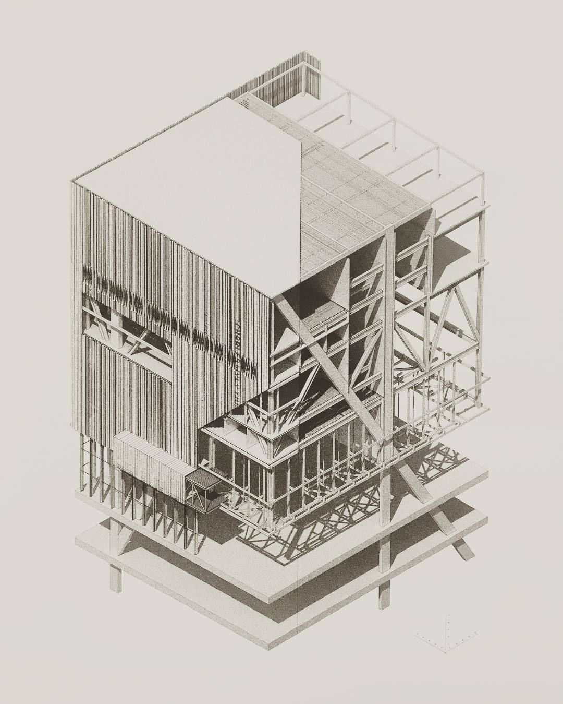

---
hide:
  - navigation
  - toc
---

<!-- Hero Section - Full Screen -->

  

    <h1 class="hero-title">iABIM — Industry Architecture</h1>
    

      
Precyzyjna dokumentacja

      
Spójny model

      
Kontrola procesu

    

    

      <a href="#oferta" class="btn btn-primary">Oferta</a>
      <a href="#portfolio" class="btn btn-secondary">Portfolio</a>
      <a href="#wiedza" class="btn btn-secondary">Wiedza</a>
      <a href="#onas" class="btn btn-secondary">O nas</a>
    

  

---

<section id="oferta">

## Oferta

  

    
&#128204;

    <h3>Dokumentacja BIM</h3>
    
Arkusze, zestawienia, detale. LOD/LOI wg wymagań kontraktu. Formaty: RVT, IFC, DWG, PDF/A.

  

  

    
&#128269;

    <h3>Koordynacja kolizji</h3>
    
Reguły, iteracje, raporty KPI. Navisworks / IFC. Wymiana uwag w BCF lub XLSX.

  

  

    
&#9881;

    <h3>Automatyzacje Revit</h3>
    
Python / pyRevit / Dynamo. Generowanie widoków, układy arkuszy, porządkowanie parametrów.

  

  

    
&#128200;

    <h3>Raporty i przepływy</h3>
    
Excel/Word/PDF z danych Revit. Eksporty z logotypami, gotowe do publikacji.

  

### Dokumentacja BIM

**Arkusze, zestawienia, detale. LOD/LOI wg wymagan.**

- Komplet rysunkow wykonawczych wg standardu biura/inwestora.
- Zestawienia wskazanych elementow z kontrola spojnosci parametrow.
- Detale i widoki pomocnicze wg preferencji projektanta.

### Koordynacja kolizji

**Reguly, iteracje, raporty KPI. Navisworks / IFC.**

- Pakiety koordynacyjne (branze, zakres, tolerancje).
- Reguly i progi (geometria, przeswity, parametry).
- Iteracje tygodniowe/sprinterskie, statusy.

### Automatyzacje Revit

**Python / pyRevit / Dynamo - przyspieszam powtarzalne czynnosci.**

- Generowanie widokow scian pomieszczen z opisem i wymiarowaniem.
- Uklad widokow na arkuszach kolumnowo wg prefiksow.
- Krotszy czas publikacji arkuszy i mniej bledow.

### Raporty i przeplywy danych

**Excel/Word/PDF z danych Revit i zrodel pomocniczych.**

- Eksporty do .xlsx z naglowkami projektu i logotypami.
- Generowanie Word/PDF z szablonow.
- Gotowe do publikacji.

</section>

---

<section id="portfolio">

## Portfolio

{{ portfolio_karty_index() }}

  <a href="portfolio/" class="btn btn-outline">Zobacz wszystkie projekty</a>

</section>

---

<section id="wiedza">

## Centrum Wiedzy

Ekspercka wiedza o architekturze przemysłowej, halach produkcyjnych i BIM.

{{ wiedza_karty_index() }}

  <a href="wiedza/" class="btn btn-outline">Zobacz wszystkie artykuły</a>

</section>

---

<section id="onas">

## O nas

<!-- Blok desktop -->

  <table style="width:100%; border-collapse:collapse; border:none;">
    <tr>
      <td style="width:66%; vertical-align:top; border:none; padding-right:2rem;">
        <h3>Specjalizacja</h3>
        
<strong>Industry Architecture iABIM</strong> specjalizuje się w dokumentacji BIM dla branży architektoniczno-budowlanej.

        
Pracujemy w obszarach <strong>OpenBim, IFC</strong>, specjalizujemy się w środowisku <strong>Autodesk Revit</strong> oraz zintegrowanych środowiskach <strong>CDE</strong>. Znamy dobrze standard <strong>ISO 19650</strong>.

        <h3>Historia</h3>
        
Początki działalności sięgają roku 2009. W 2025 roku powstała marka <strong>Industry Architecture iABIM</strong>, której misją jest łączenie wiedzy architektonicznej z nowoczesnymi standardami BIM.

      </td>
      <td style="width:34%; text-align:center; vertical-align:middle; border:none;">
        
      </td>
    </tr>
  </table>

  <h3>Specjalizacja</h3>
  
<strong>Industry Architecture iABIM</strong> specjalizuje się w dokumentacji BIM dla branży architektoniczno-budowlanej.

  
  
Pracujemy w obszarach <strong>OpenBim, IFC</strong>, specjalizujemy się w środowisku <strong>Autodesk Revit</strong> oraz zintegrowanych środowiskach <strong>CDE</strong>.

---

### Zespół

  <table style="width:100%; border-collapse:collapse; border:none;">
    <tr>
      <td style="width:50%; vertical-align:top; border:none; padding:1rem;">
        <table style="width:100%; border:none;">
          <tr>
            <td style="width:60%; vertical-align:top; border:none; padding-right:1rem;">
              <h4>Piotr Choromański</h4>
              
<em>Architekt / BIM Lead</em>

              
Specjalizuje się w dokumentacji architektonicznej oraz wdrażaniu standardów BIM.

            </td>
            <td style="width:40%; vertical-align:middle; border:none; text-align:center;">
              
            </td>
          </tr>
        </table>
      </td>
      <td style="width:50%; vertical-align:top; border:none; padding:1rem;">
        <table style="width:100%; border:none;">
          <tr>
            <td style="width:60%; vertical-align:top; border:none; padding-right:1rem;">
              <h4>Małgorzata Choromańska</h4>
              
<em>Idea / Concept / Script Specialist</em>

              
Tworzy wizję firmy i narzędzia automatyzujące pracę w Revit i pyRevit.

            </td>
            <td style="width:40%; vertical-align:middle; border:none; text-align:center;">
              
            </td>
          </tr>
        </table>
      </td>
    </tr>
  </table>

  <h4>Piotr Choromański</h4>
  
<em>Architekt / BIM Lead</em>

  
  
Specjalizuje się w dokumentacji architektonicznej oraz wdrażaniu standardów BIM.

  <h4>Małgorzata Choromańska</h4>
  
<em>Idea / Concept / Script Specialist</em>

  
  
Tworzy wizję firmy i narzędzia automatyzujące pracę w Revit i pyRevit.

---

### Kontakt

  

    <h4>Dane kontaktowe</h4>
    
<strong>Biuro</strong> 
    ul. Stelmachów 58b/3 
    31-234 Kraków

    
<strong>E-mail</strong> 
    <a href="mailto:kontakt@iabim.eu">kontakt@iabim.eu</a>

    
<strong>Telefon</strong> 
    <a href="tel:+48785195173">+48 785 195 173</a>

  

  

    <h4>Dane firmowe</h4>
    
<strong>Industry Architecture iABIM</strong> 
    Stelmachów 58b/3 
    31-234 Kraków

    
<strong>NIP:</strong> 657-215-74-73 
    <strong>REGON:</strong> 021040055

  

  <h2>Napisz do nas</h2>
  
Chętnie odpowiemy na pytania dotyczące dokumentacji BIM, koordynacji czy automatyzacji.

  <a href="mailto:kontakt@iabim.eu" class="btn btn-primary">kontakt@iabim.eu</a>

<a href="polityka-prywatnosci/">Polityka prywatności</a>

</section>
