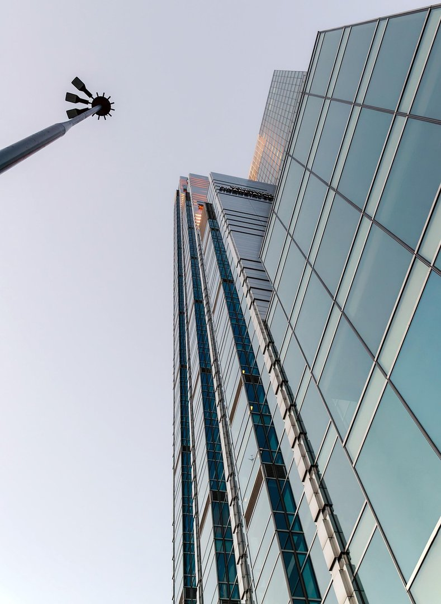

# Dom jednorodzinny Skała

  

  

    <strong>Typ</strong>
    Mieszkalny jednorodzinny
  

  

    <strong>Powierzchnia</strong>
    240 m²
  

  

    <strong>Stadium</strong>
    Realizacja
  

  

    <strong>Lokalizacja</strong>
    Skała, woj. małopolskie
  

  

    <strong>Realizacja</strong>
    2021
  

---

## O projekcie

Nowoczesny dom jednorodzinny zaprojektowany dla rodziny 4-osobowej. Charakterystyczny płaski dach, duże przeszklenia i otwarta przestrzeń dzienna. Budynek wyposażony w pompę ciepła i rekuperację.

## Zakres prac BIM

- Model architektoniczny LOD 350
- Projekt wykonawczy
- Wizualizacje 3D

## Galeria

  <figure class="gallery-item">
    <a href="../../img/portfolio/dom-skala/01_hero.jpg" class="glightbox" data-gallery="portfolio-dom-skala">
      
      <figcaption>01 Hero</figcaption>
    </a>
  </figure>

---

  <a href="../" class="btn btn-outline">Powrót do portfolio</a>

