# Budynek produkcyjny

  <a href="../../img/portfolio/produkcja/1A_DSC_1359lrg.jpg" class="glightbox" data-gallery="portfolio-produkcja">
    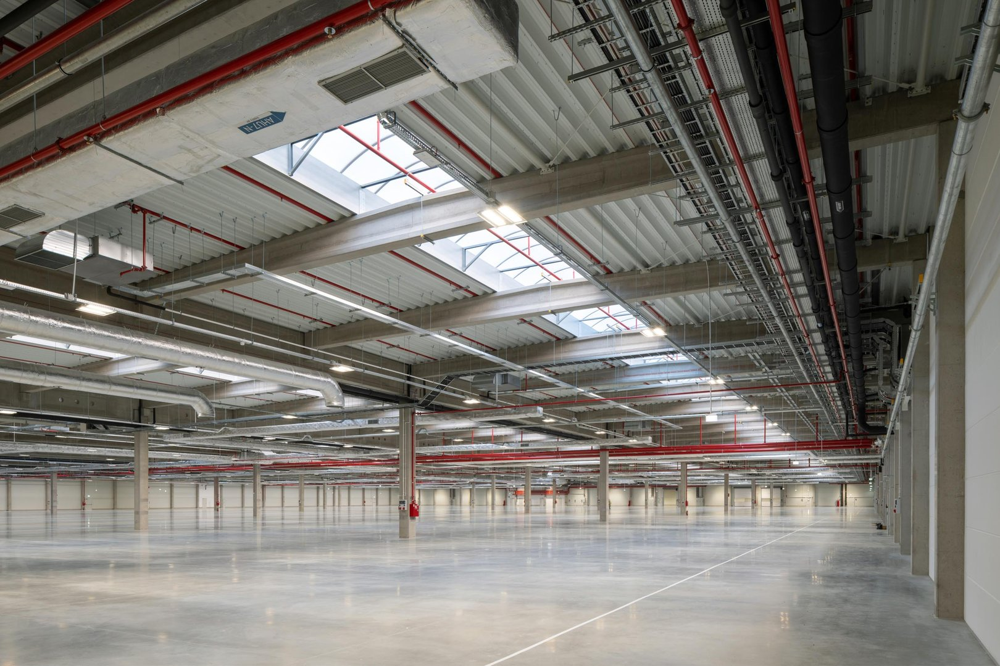
  </a>

  

    <strong>Klient</strong>
    <b>KOMA TOMASZ MAGIERA</b>
  

  

    <strong>Typ</strong>
    Budynek produkcyjny
  

  

    <strong>Powierzchnia</strong>
    32 000 m²
  

  

    <strong>Stadium</strong>
    Realizacja
  

  

    <strong>Lokalizacja</strong>
    Legnica
  

  

    <strong>Realizacja</strong>
    2026
  

  

    <strong>Wykonawca</strong>
    <b>TAKENAKA</b>
  

---

## O projekcie

Hala przemysłowa o prostej, funkcjonalnej formie architektonicznej, oparta na geometrycznej bryle z wyraźnie wydzieloną częścią biurowo-socjalną oraz produkcyjną. Elewacje utrzymano w powtarzalnym, modułowym układzie paneli i przeszkleń, zgodnym z rytmem konstrukcji obiektu. Strefa produkcyjna została zaprojektowana jako przestrzeń o dużych rozpiętościach umożliwiających elastyczne zagospodarowanie technologiczne, z bezpośrednim dostępem do stref logistycznych, manewrowych i magazynowych. W obiekcie przewidziano również część magazynową wspierającą procesy produkcyjne, a część biurowo-socjalna została podkreślona większym udziałem przeszklenia i bardziej uporządkowaną kompozycją elewacji. Całość utrzymano w estetyce współczesnego obiektu przemysłowego o wysokiej funkcjonalności operacyjnej.

**Zespół autorski:** KOMA - konstrukcja, MKJANURA - instalacje sanitarne, MKJANURA - instalacje elektryczne  i teletechniczne

## Zakres prac pracowni IA

- Projekt budowlany
- Projekt wykonawczy
- Projekt powykonawczy
- LOD350

## Galeria

  <figure class="gallery-item">
    <a href="../../img/portfolio/produkcja/1A_DSC_1359lrg.jpg" class="glightbox" data-gallery="portfolio-produkcja">
      
      <figcaption>1A Dsc 1359Lrg</figcaption>
    </a>
  </figure>
  <figure class="gallery-item">
    <a href="../../img/portfolio/produkcja/DJI_20260116102050_0012_D.jpg" class="glightbox" data-gallery="portfolio-produkcja">
      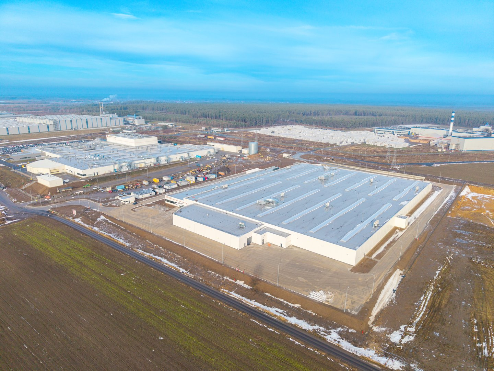
      <figcaption>Dji 20260116102050 0012 D</figcaption>
    </a>
  </figure>
  <figure class="gallery-item">
    <a href="../../img/portfolio/produkcja/DJI_20260116102126_0013_D.jpg" class="glightbox" data-gallery="portfolio-produkcja">
      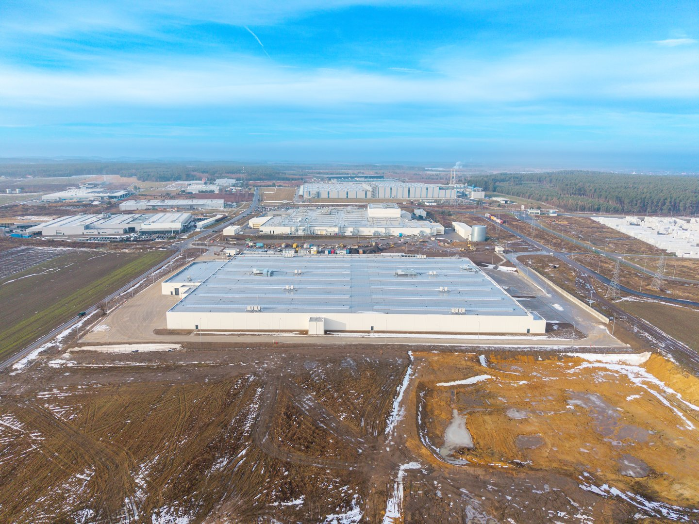
      <figcaption>Dji 20260116102126 0013 D</figcaption>
    </a>
  </figure>
  <figure class="gallery-item">
    <a href="../../img/portfolio/produkcja/DJI_20260116102151_0014_D.jpg" class="glightbox" data-gallery="portfolio-produkcja">
      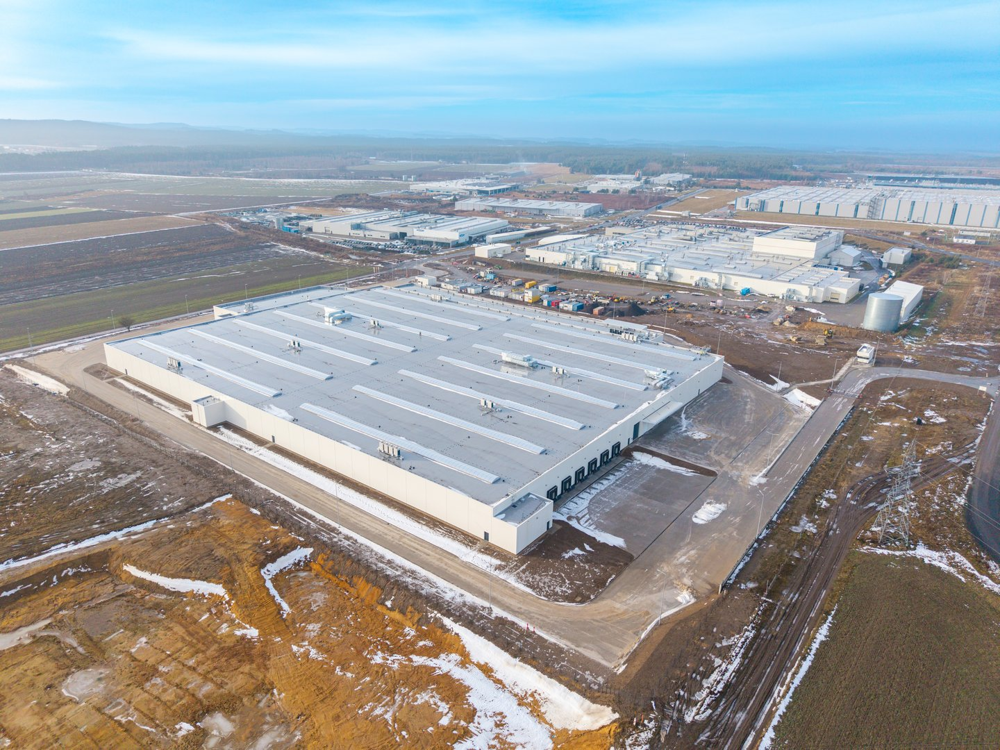
      <figcaption>Dji 20260116102151 0014 D</figcaption>
    </a>
  </figure>
  <figure class="gallery-item">
    <a href="../../img/portfolio/produkcja/DJI_20260116102215_0015_D.jpg" class="glightbox" data-gallery="portfolio-produkcja">
      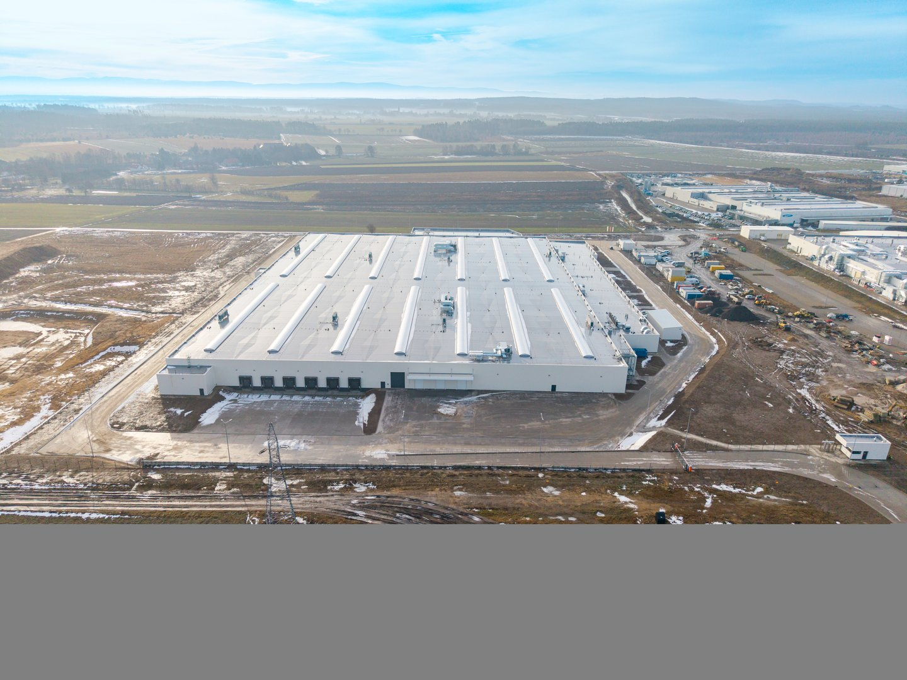
      <figcaption>Dji 20260116102215 0015 D</figcaption>
    </a>
  </figure>
  <figure class="gallery-item">
    <a href="../../img/portfolio/produkcja/DSC_1040lrg.jpg" class="glightbox" data-gallery="portfolio-produkcja">
      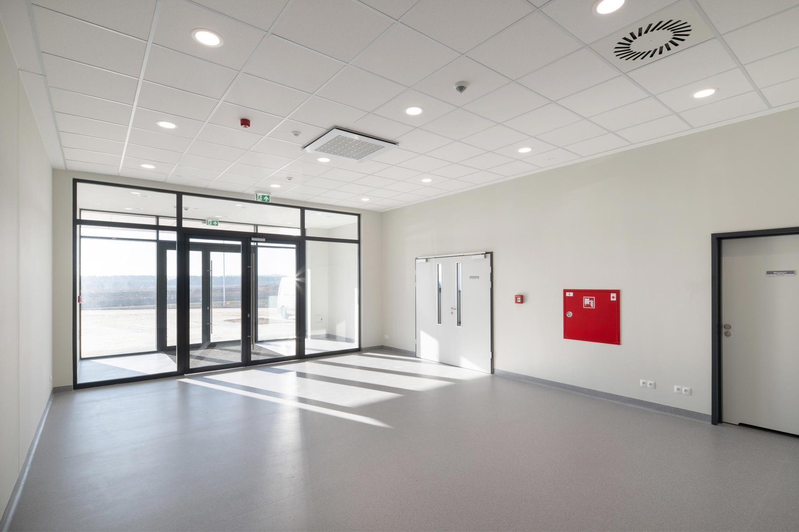
      <figcaption>Dsc 1040Lrg</figcaption>
    </a>
  </figure>
  <figure class="gallery-item">
    <a href="../../img/portfolio/produkcja/DSC_1050lrg.jpg" class="glightbox" data-gallery="portfolio-produkcja">
      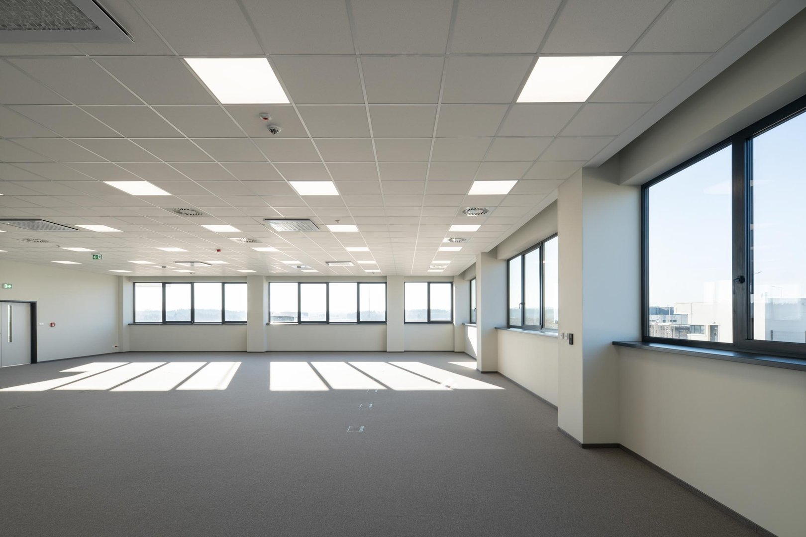
      <figcaption>Dsc 1050Lrg</figcaption>
    </a>
  </figure>
  <figure class="gallery-item">
    <a href="../../img/portfolio/produkcja/DSC_1192lrg.jpg" class="glightbox" data-gallery="portfolio-produkcja">
      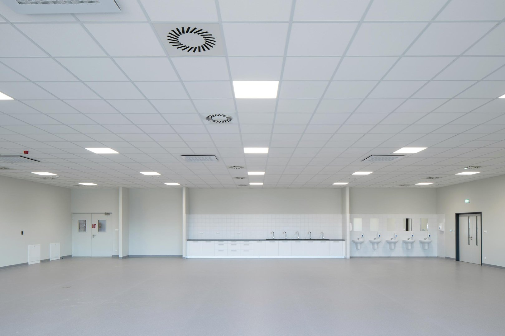
      <figcaption>Dsc 1192Lrg</figcaption>
    </a>
  </figure>
  <figure class="gallery-item">
    <a href="../../img/portfolio/produkcja/DSC_1207lrg.jpg" class="glightbox" data-gallery="portfolio-produkcja">
      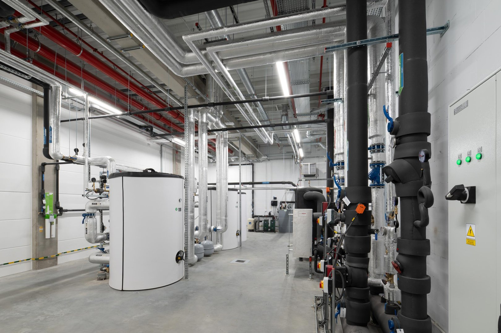
      <figcaption>Dsc 1207Lrg</figcaption>
    </a>
  </figure>
  <figure class="gallery-item">
    <a href="../../img/portfolio/produkcja/DSC_1294lrg.jpg" class="glightbox" data-gallery="portfolio-produkcja">
      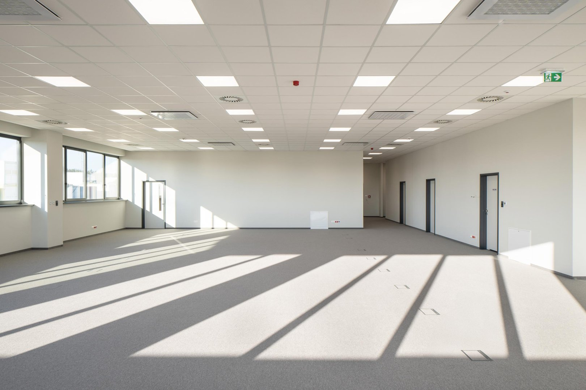
      <figcaption>Dsc 1294Lrg</figcaption>
    </a>
  </figure>
  <figure class="gallery-item">
    <a href="../../img/portfolio/produkcja/DSC_1364lrg.jpg" class="glightbox" data-gallery="portfolio-produkcja">
      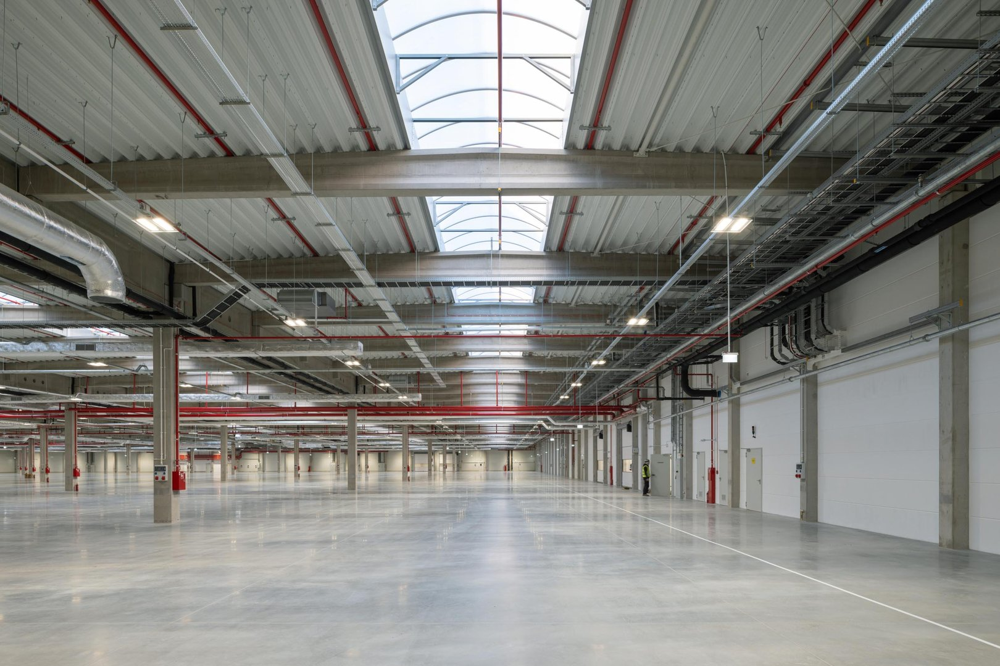
      <figcaption>Dsc 1364Lrg</figcaption>
    </a>
  </figure>

---

  <a href="../" class="kategoria-link wiedza-back">Powrót do portfolio</a>

