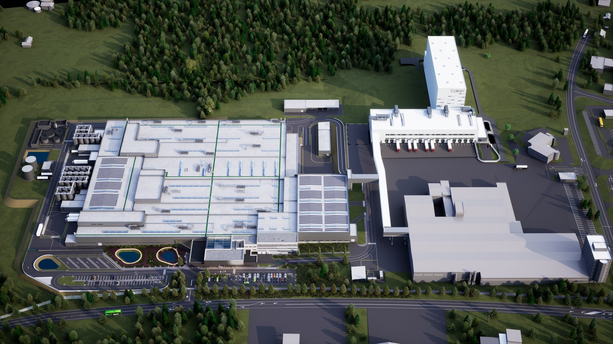
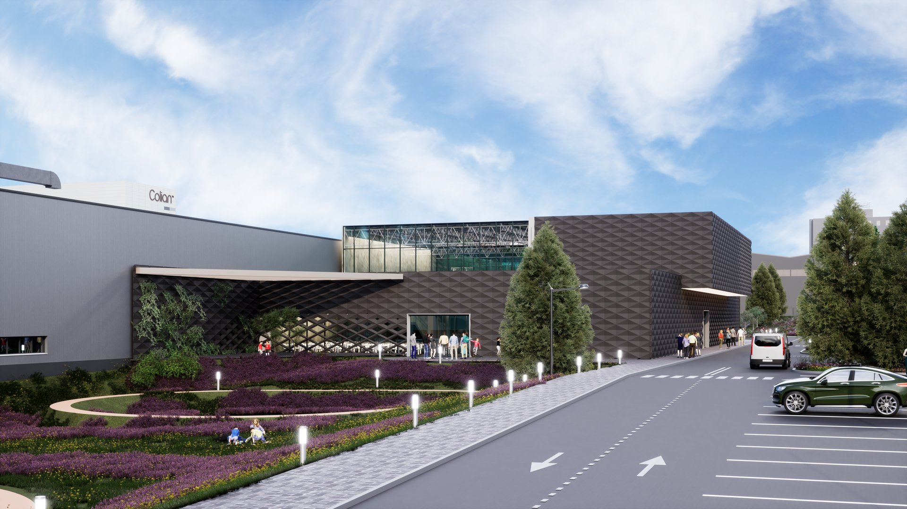
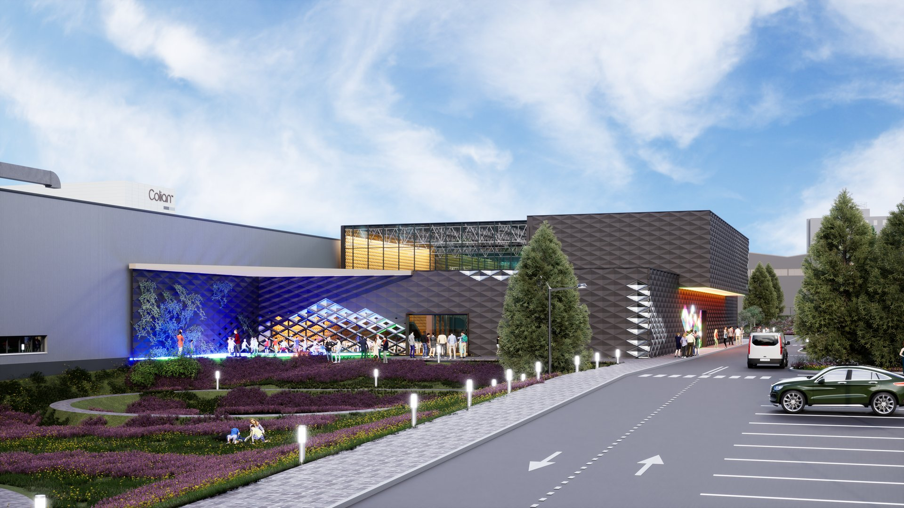
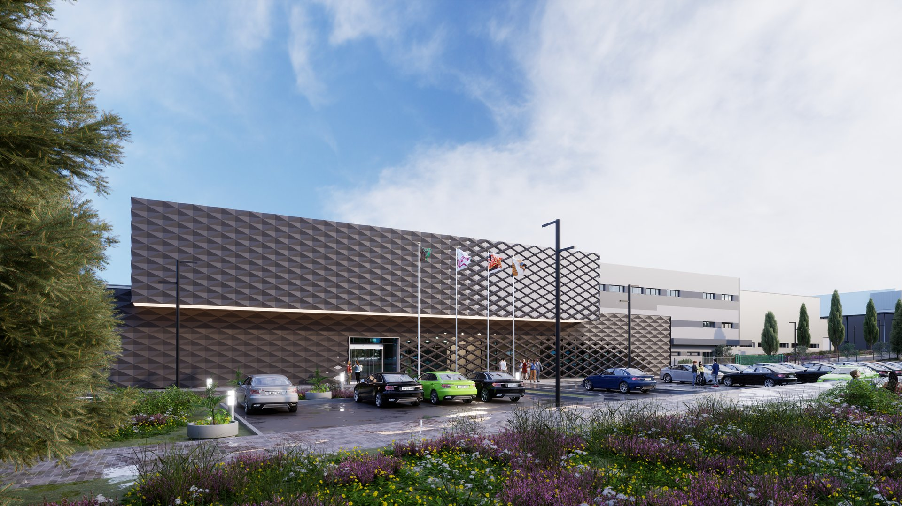
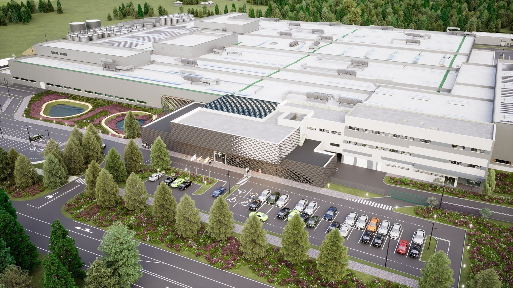
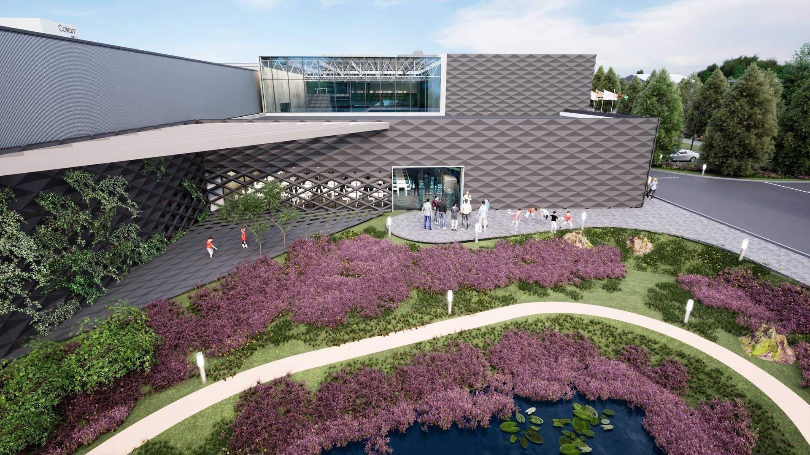
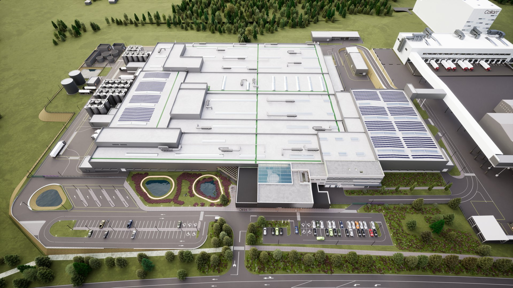

# Budynek produkcyjny

  

  

    <strong>Klient</strong>
    <b>METROPLAN</b>
  

  

    <strong>Typ</strong>
    Budynek produkcyjny
  

  

    <strong>Powierzchnia</strong>
    72 000 m²
  

  

    <strong>Stadium</strong>
    Koncepcja wielobranżowa
  

  

    <strong>Lokalizacja</strong>
    Opatówek
  

  

    <strong>Realizacja</strong>
    2021
  

  

    <strong>Wykonawca</strong>
    <b></b>
  

---

## O projekcie

Obiekt przemysłowy dla branży spożywczej wykonany na zlecenie firmy Metroplan Polska, zaprojektowany jako hala produkcyjna o prostej, funkcjonalnej bryle z wyraźnie wydzieloną częścią produkcyjną, magazynową oraz biurowo-socjalną. Koncepcja zakłada realizację muzeum z trasą zwiedzania przebiegającą na różnych poziomach, umożliwiającą obserwację procesu produkcyjnego w przekroju funkcjonalnym obiektu. Kompozycja elewacji opiera się na powtarzalnym rytmie modułów i przeszkleń podkreślających strefy wejściowe i administracyjne, natomiast przestrzeń hali wykazuje dużą elastyczność funkcjonalną. Projekt uwzględnia wymagania branży spożywczej oraz wysokie standardy techniczne, a jednocześnie integruje elementy ekspozycyjne w strukturze przemysłowej bryły.

## Zakres prac pracowni IA

- Model konstrukcyjny LOD 300
- Koordynacja branżowa
- Dokumentacja powykonawcza

## Galeria

  <figure class="gallery-item">
    <a href="../../img/portfolio/produkcja1/CFF_001.jpg" class="glightbox" data-gallery="portfolio-produkcja1">
      
      <figcaption>Cff 001</figcaption>
    </a>
  </figure>
  <figure class="gallery-item">
    <a href="../../img/portfolio/produkcja1/CFF_002.jpg" class="glightbox" data-gallery="portfolio-produkcja1">
      
      <figcaption>Cff 002</figcaption>
    </a>
  </figure>
  <figure class="gallery-item">
    <a href="../../img/portfolio/produkcja1/CFF_003.jpg" class="glightbox" data-gallery="portfolio-produkcja1">
      
      <figcaption>Cff 003</figcaption>
    </a>
  </figure>
  <figure class="gallery-item">
    <a href="../../img/portfolio/produkcja1/CFF_003_000.jpg" class="glightbox" data-gallery="portfolio-produkcja1">
      
      <figcaption>Cff 003 000</figcaption>
    </a>
  </figure>
  <figure class="gallery-item">
    <a href="../../img/portfolio/produkcja1/CFF_004.jpg" class="glightbox" data-gallery="portfolio-produkcja1">
      
      <figcaption>Cff 004</figcaption>
    </a>
  </figure>
  <figure class="gallery-item">
    <a href="../../img/portfolio/produkcja1/CFF_005.jpg" class="glightbox" data-gallery="portfolio-produkcja1">
      
      <figcaption>Cff 005</figcaption>
    </a>
  </figure>
  <figure class="gallery-item">
    <a href="../../img/portfolio/produkcja1/CFF_007.jpg" class="glightbox" data-gallery="portfolio-produkcja1">
      
      <figcaption>Cff 007</figcaption>
    </a>
  </figure>
  <figure class="gallery-item">
    <a href="../../img/portfolio/produkcja1/CFF_008.jpg" class="glightbox" data-gallery="portfolio-produkcja1">
      
      <figcaption>Cff 008</figcaption>
    </a>
  </figure>

---

  <a href="../" class="kategoria-link wiedza-back">Powrót do portfolio</a>

