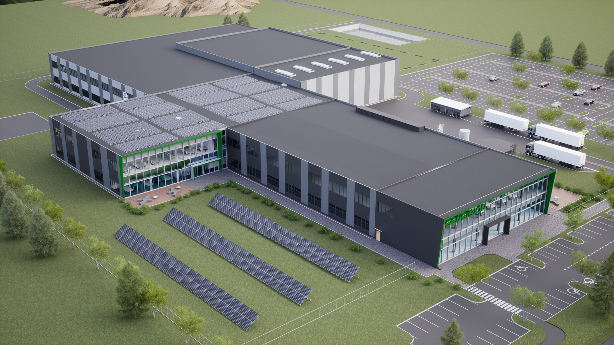
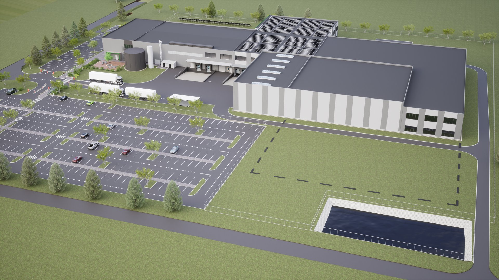

# Budynek produkcyjny

  

  

    <strong>Typ</strong>
    Budynek produkcyjny
  

  

    <strong>Powierzchnia</strong>
    8 000 m²
  

  

    <strong>Stadium</strong>
    Realizacja
  

  

    <strong>Lokalizacja</strong>
    Stoczek
  

---

## O projekcie

Hala produkcyjna z częścią biurowo-socjalną. Konstrukcja stalowa, duże rozpiętości, nowoczesne systemy wentylacji i oświetlenia. Projekt realizowany w technologii BIM od fazy koncepcyjnej.

## Zakres prac BIM

- Model konstrukcyjny LOD 300
- Koordynacja branżowa
- Dokumentacja powykonawcza

## Galeria

  <figure class="gallery-item">
    <a href="../../img/portfolio/produkcja2/02.jpg" target="_blank">
      
      <figcaption>02</figcaption>
    </a>
  </figure>
  <figure class="gallery-item">
    <a href="../../img/portfolio/produkcja2/03.jpg" target="_blank">
      
      <figcaption>03</figcaption>
    </a>
  </figure>

---

  <a href="../" class="btn btn-outline">Powrót do portfolio</a>

