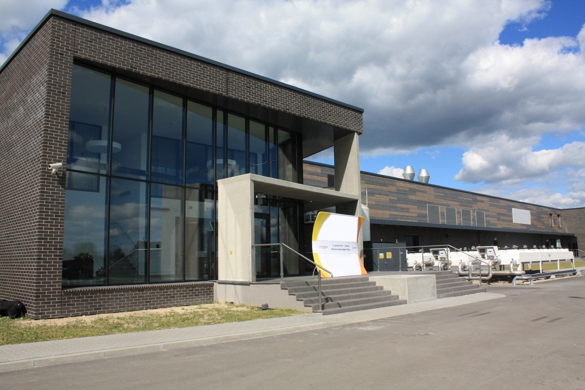
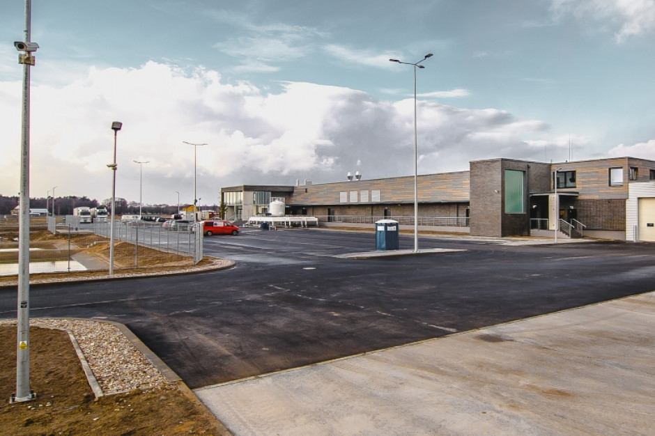
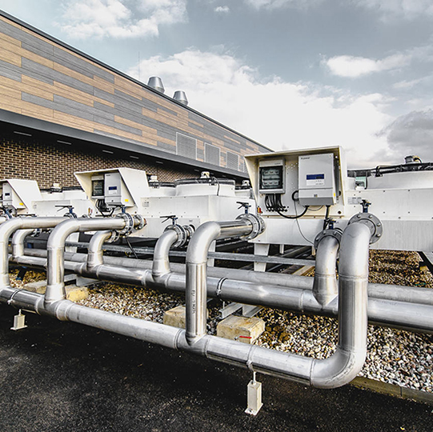
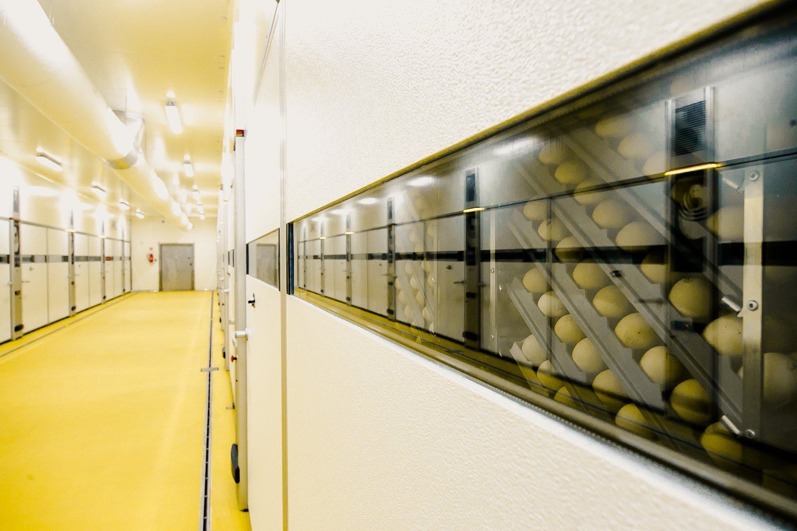
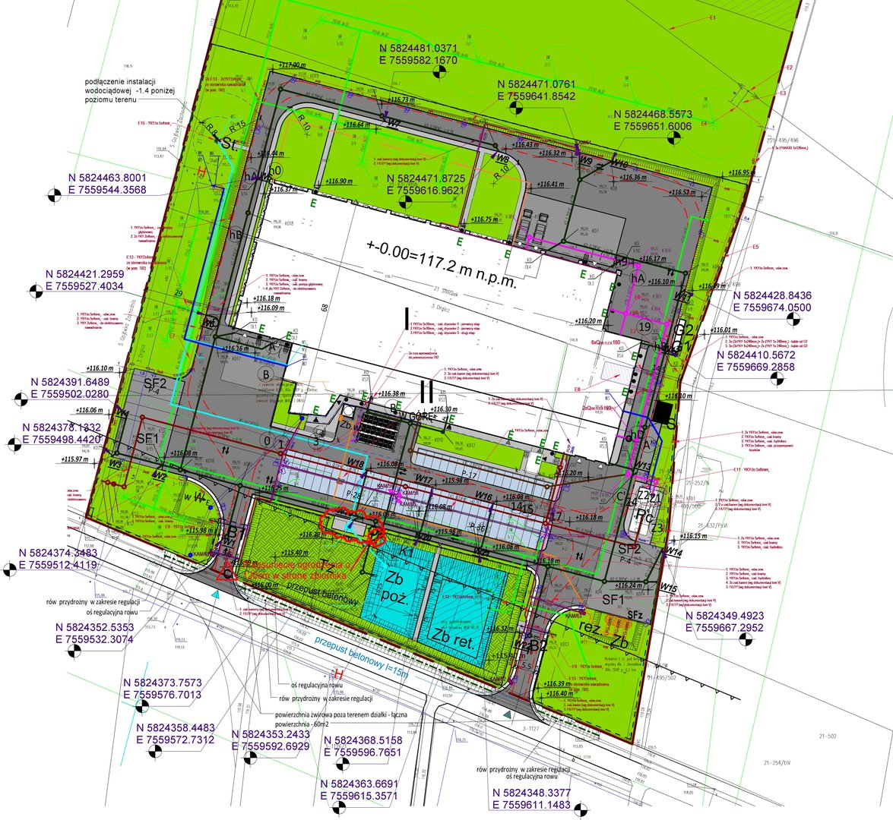

# Budynek produkcyjny

  

  

    <strong>Klient</strong>
    <b>INTEGRA</b>
  

  

    <strong>Typ</strong>
    Budynek produkcyjny
  

  

    <strong>Powierzchnia</strong>
    8 800 m²
  

  

    <strong>Stadium</strong>
    Realizacja
  

  

    <strong>Lokalizacja</strong>
    Stoczek
  

  

    <strong>Realizacja</strong>
    2016
  

  

    <strong>Wykonawca</strong>
    <b>SKANSKA</b>
  

---

## O projekcie

Obiekt przemysłowy dla branży spożywczej, zaprojektowany zgodnie z wymaganiami sanitarnymi HACCP, o funkcjonalnym i czytelnym układzie przestrzennym. Bryła łączy strefę produkcyjną, magazynową oraz zaplecze biurowo-socjalne. W projekcie zastosowano szatnię przepustową o podwyższonym standardzie higienicznym, umożliwiającą kontrolowany przepływ pracowników pomiędzy strefami technologicznymi. Obiekt uzupełnia przyzakładowa podczyszczalnia ścieków, część mieszkalna dla pracowników pełniących stały nadzór nad produkcją oraz przestrzeń dla obsługi nadzorującej funkcjonowanie zakładu. Całość utrzymano w estetyce współczesnego obiektu przemysłowego o prostej, modułowej formie architektonicznej.

**Zespół autorski:** ACI- PROJEKT - konstrukcja, PROINSTAL - instalacje sanitarne,MKJANURA - instalacje elektryczne  i teletechniczne

## Zakres prac pracowni IA

- BIM management
- Koncepcja wielobrażowa
- Projekt budowlany
- Projekt wykonawczy
- Kontrola kolizji

## Galeria

  <figure class="gallery-item">
    <a href="../../img/portfolio/produkcja2/000_89f1al4lgzyrcd6o2.jpg" class="glightbox" data-gallery="portfolio-produkcja2">
      
      <figcaption>000 89F1Al4Lgzyrcd6O2</figcaption>
    </a>
  </figure>
  <figure class="gallery-item">
    <a href="../../img/portfolio/produkcja2/001_97944_r0_940.jpg" class="glightbox" data-gallery="portfolio-produkcja2">
      
      <figcaption>001 97944 R0 940</figcaption>
    </a>
  </figure>
  <figure class="gallery-item">
    <a href="../../img/portfolio/produkcja2/001_stoczek_web.jpg" class="glightbox" data-gallery="portfolio-produkcja2">
      
      <figcaption>001 Stoczek Web</figcaption>
    </a>
  </figure>
  <figure class="gallery-item">
    <a href="../../img/portfolio/produkcja2/002_Integra_Stoczek_.jpg" class="glightbox" data-gallery="portfolio-produkcja2">
      
      <figcaption>002 Integra Stoczek </figcaption>
    </a>
  </figure>
  <figure class="gallery-item">
    <a href="../../img/portfolio/produkcja2/STL-0088-IA-A-PW-2016-02-26.jpg" class="glightbox" data-gallery="portfolio-produkcja2">
      
      <figcaption>Stl 0088 Ia A Pw 2016 02 26</figcaption>
    </a>
  </figure>
  <figure class="gallery-item">
    <a href="../../img/portfolio/produkcja2/STL-0088-IA-A-PW-2016-02-26_3d koordn.jpg" class="glightbox" data-gallery="portfolio-produkcja2">
      
      <figcaption>Stl 0088 Ia A Pw 2016 02 26 3D Koordn</figcaption>
    </a>
  </figure>

---

  <a href="../" class="kategoria-link wiedza-back">Powrót do portfolio</a>

