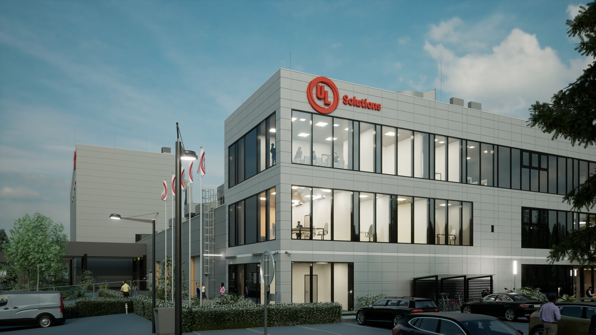
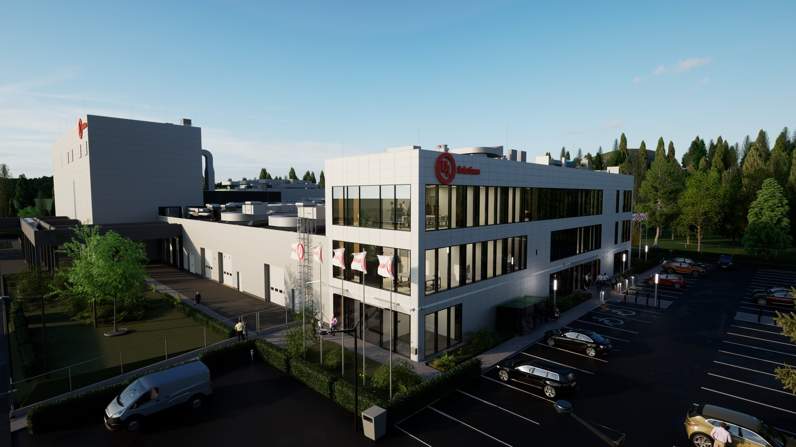
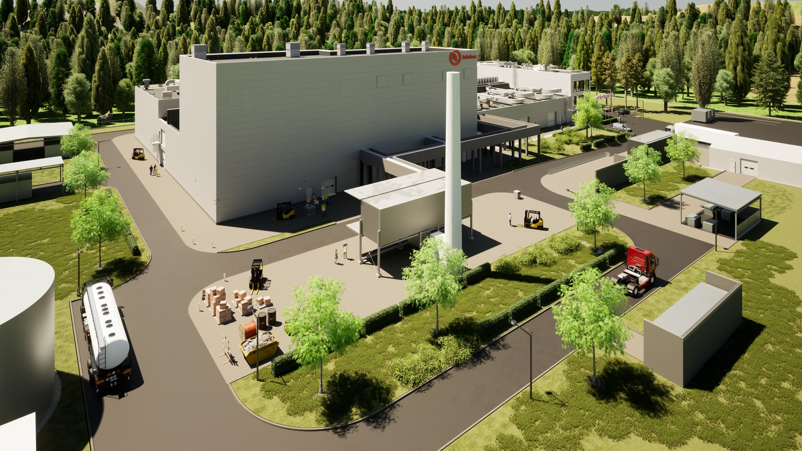
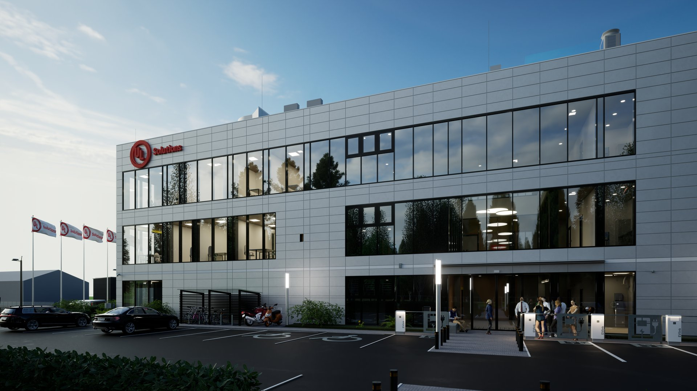
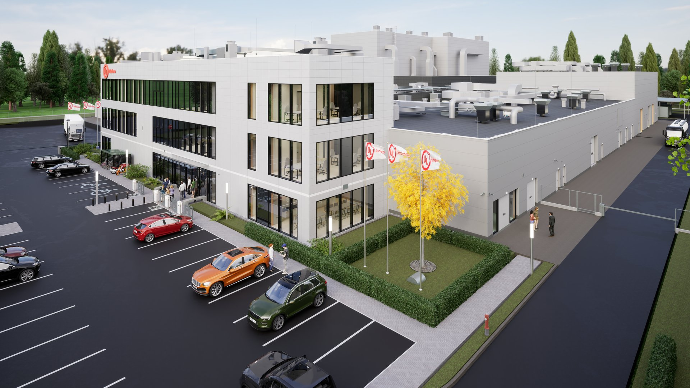

# Budynek produkcyjny

  

  

    <strong>Klient</strong>
    <b>METROPLAN</b>
  

  

    <strong>Typ</strong>
    Budynek biurowo-laboratoryjny
  

  

    <strong>Powierzchnia</strong>
    6 700 m²
  

  

    <strong>Stadium</strong>
    Przetarg funkcjonalny
  

  

    <strong>Lokalizacja</strong>
    Bez lokalizacji
  

  

    <strong>Realizacja</strong>
    2023
  

  

    <strong>Wykonawca</strong>
    <b></b>
  

---

## O projekcie

Budynek biurowo‑laboratoryjny zaprojektowany jako projekt koncepcyjny i przetargowy w celu poszukiwania optymalnej lokalizacji oraz opracowania układu funkcjonalnego w formule ideal plan layout, przygotowany wraz z zespołem Metroplan.

**Zespół autorski:** BMP - konstrukcja, MKJANURA - instalacje sanitarne, MKJANURA - instalacje elektryczne  i teletechniczne

## Zakres prac pracowni IA

- BIM management
- Projekt przetargowy
- Koordynacja branżowa
- Kontrola kolizji

## Galeria

  <figure class="gallery-item">
    <a href="../../img/portfolio/produkcja3/1.jpg" class="glightbox" data-gallery="portfolio-produkcja3">
      
      <figcaption>1</figcaption>
    </a>
  </figure>
  <figure class="gallery-item">
    <a href="../../img/portfolio/produkcja3/2.jpg" class="glightbox" data-gallery="portfolio-produkcja3">
      
      <figcaption>2</figcaption>
    </a>
  </figure>
  <figure class="gallery-item">
    <a href="../../img/portfolio/produkcja3/3.jpg" class="glightbox" data-gallery="portfolio-produkcja3">
      
      <figcaption>3</figcaption>
    </a>
  </figure>
  <figure class="gallery-item">
    <a href="../../img/portfolio/produkcja3/4.jpg" class="glightbox" data-gallery="portfolio-produkcja3">
      
      <figcaption>4</figcaption>
    </a>
  </figure>
  <figure class="gallery-item">
    <a href="../../img/portfolio/produkcja3/5.jpg" class="glightbox" data-gallery="portfolio-produkcja3">
      
      <figcaption>5</figcaption>
    </a>
  </figure>

---

  <a href="../" class="kategoria-link wiedza-back">Powrót do portfolio</a>

