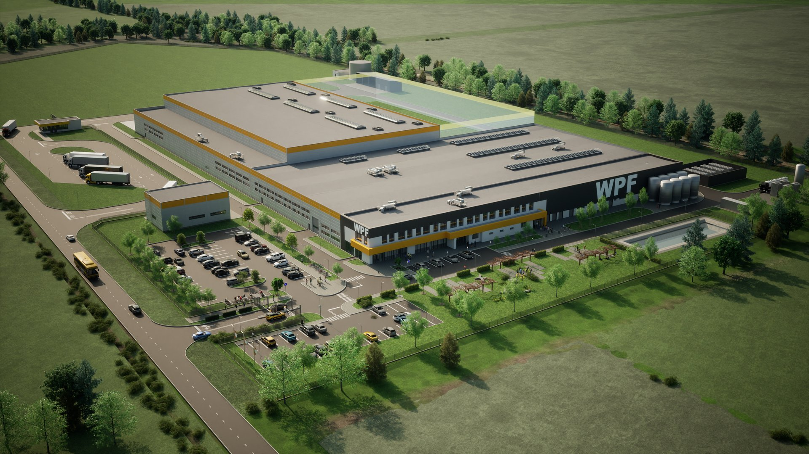
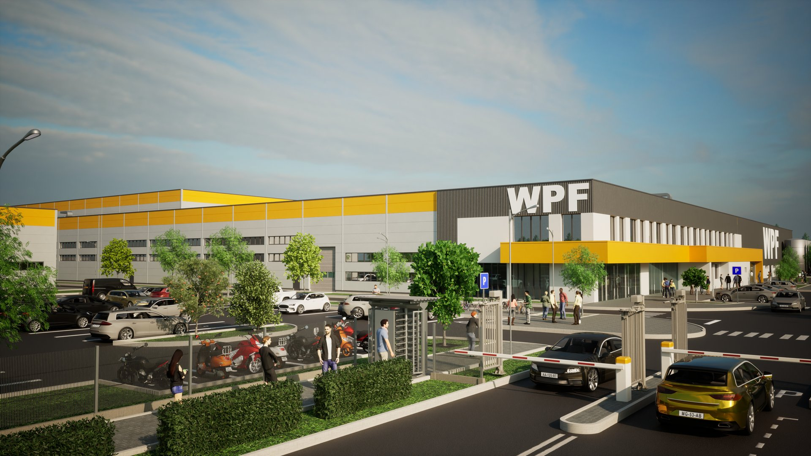
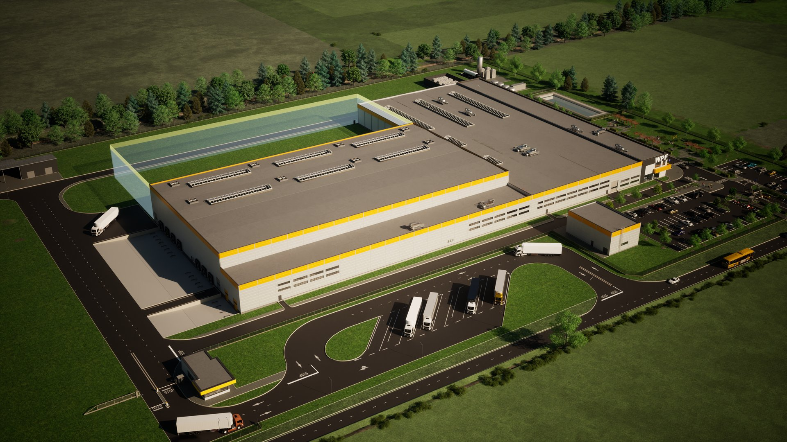
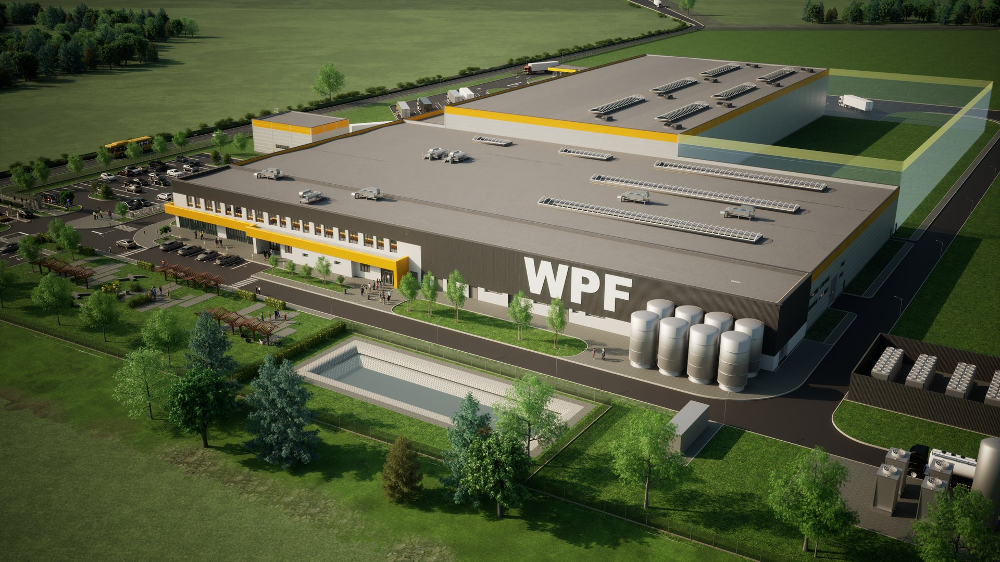

# Budynek produkcyjny

  

  

    <strong>Typ</strong>
    Budynek produkcyjny
  

  

    <strong>Powierzchnia</strong>
    10 000 m²
  

  

    <strong>Stadium</strong>
    Projekt budowlany / Wykonawczy
  

  

    <strong>Lokalizacja</strong>
    Brzesko
  

  

    <strong>Realizacja</strong>
    2021
  

---

## O projekcie

Hala produkcyjna z częścią biurowo-socjalną. Konstrukcja stalowa, duże rozpiętości, nowoczesne systemy wentylacji i oświetlenia. Projekt realizowany w technologii BIM od fazy koncepcyjnej.

## Zakres prac BIM

- Model konstrukcyjny LOD 200
- Koordynacja branżowa
- Dokumentacja powykonawcza

## Galeria

  <figure class="gallery-item">
    <a href="../../img/portfolio/produkcja4/02.jpg" target="_blank">
      
      <figcaption>02</figcaption>
    </a>
  </figure>
  <figure class="gallery-item">
    <a href="../../img/portfolio/produkcja4/03.jpg" target="_blank">
      
      <figcaption>03</figcaption>
    </a>
  </figure>
  <figure class="gallery-item">
    <a href="../../img/portfolio/produkcja4/04.jpg" target="_blank">
      
      <figcaption>04</figcaption>
    </a>
  </figure>

---

  <a href="../" class="btn btn-outline">Powrót do portfolio</a>

