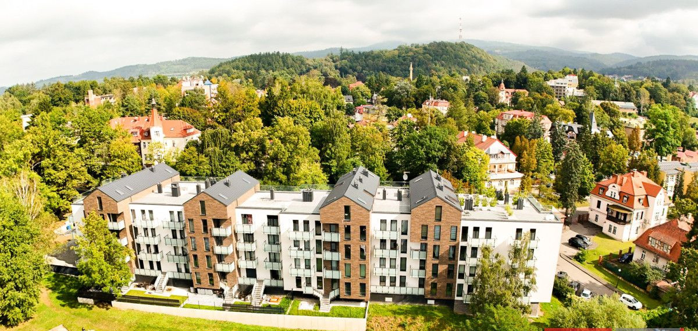
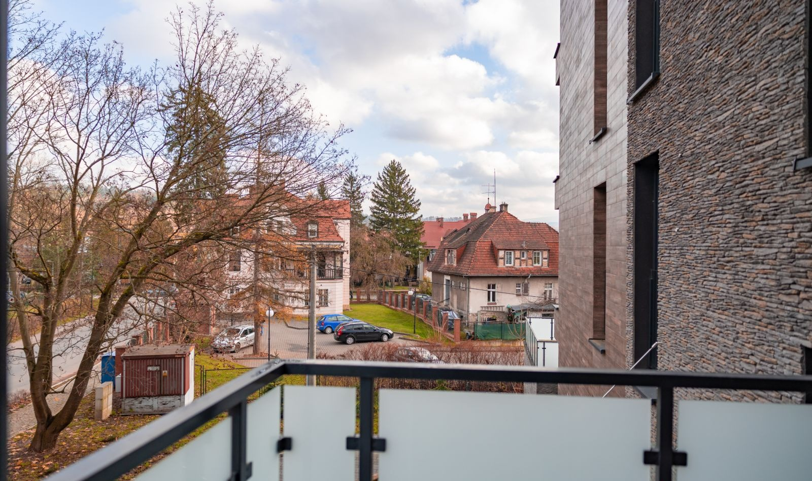
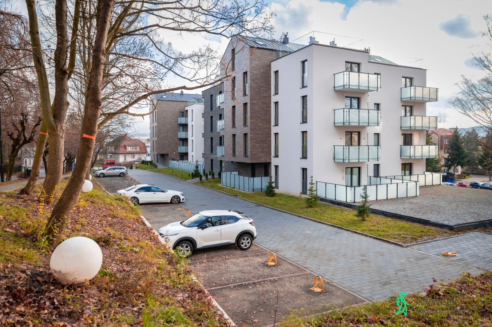
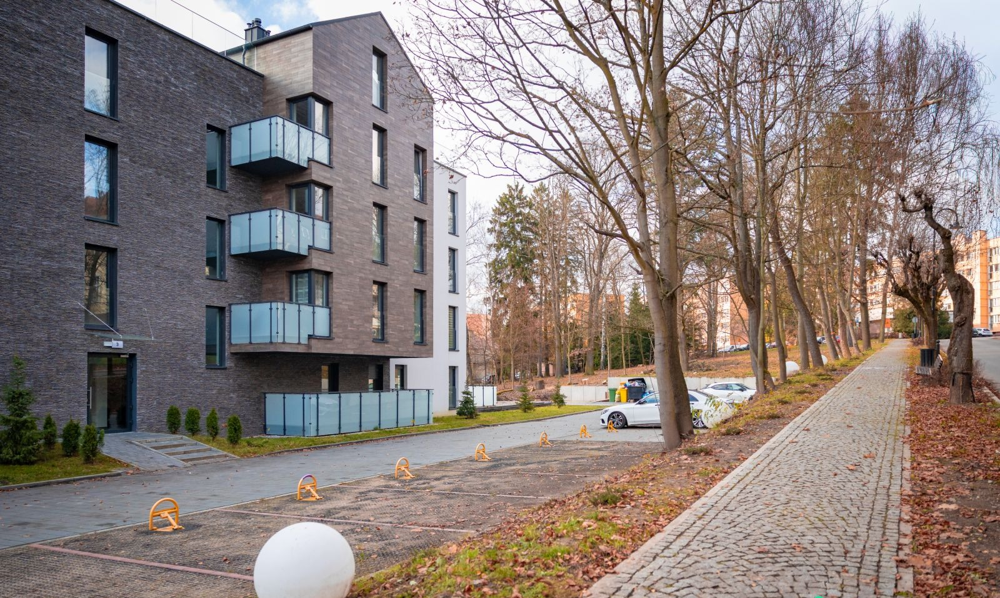
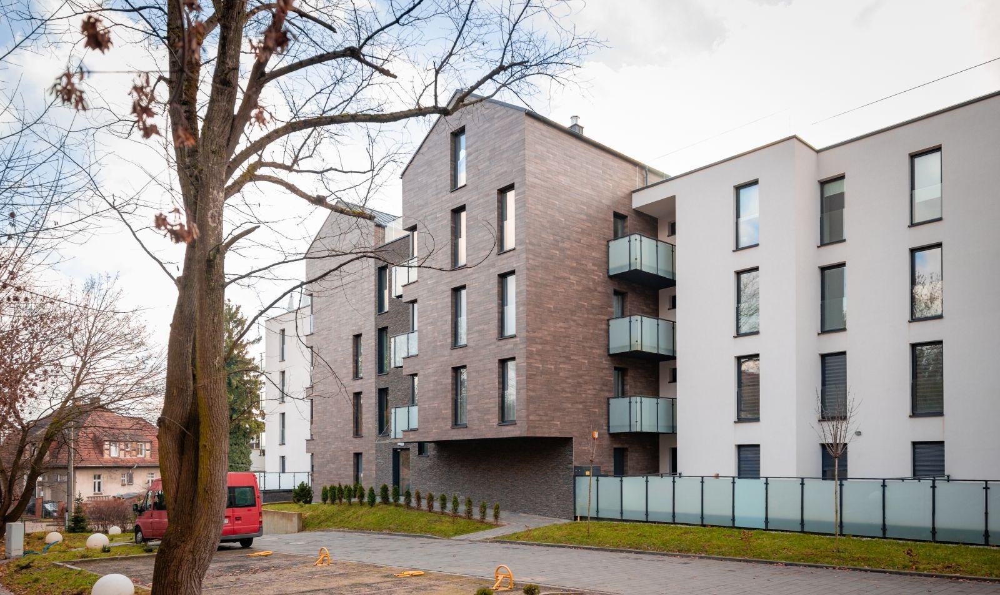

# Slavita Park

  

  

    <strong>Klient</strong>
    <b>	IG APARTMENTS</b>
  

  

    <strong>Typ</strong>
    Budynek wielorodzinny
  

  

    <strong>Powierzchnia</strong>
    3890 m²
  

  

    <strong>Stadium</strong>
    Realizacja
  

  

    <strong>Lokalizacja</strong>
    Kudowa Zdrój
  

  

    <strong>Realizacja</strong>
    2021
  

  

    <strong>Wykonawca</strong>
    <b>	IG APARTMENTS</b>
  

---

## O projekcie

Wielokondygnacyjny budynek mieszkalny zlokalizowany w ścisłym centrum Kudowy-Zdrój, zaprojektowany jako zwarta, współczesna bryła o zróżnicowanej wysokości i czytelnym rytmie elewacji. Obiekt mieści 72 apartamenty o zróżnicowanej powierzchni – od 45 m² do 145 m², w tym dwupoziomowe apartamenty z tarasami zlokalizowanymi na najwyższej kondygnacji na dachu budynku. Projekt akcentuje poziome podziały balkonów i loggii, a zastosowane przeszklenia i stonowana kolorystyka elewacji pozwalają na harmonijne wpisanie obiektu w kontekst uzdrowiskowego otoczenia. Integralną częścią inwestycji jest podziemny parking dla mieszkańców, zapewniający obsługę komunikacyjną bez ingerencji w strefę parteru. Sylwetka budynku została ukształtowana tak, aby eksponować strefę tarasów dachowych jako charakterystyczny element kompozycyjny obiektu.

**Zespół autorski:** RM Projekt - konstrukcja, BILAN - instalacje sanitarne, CORRENTEA- instalacje elektryczne i teletechniczne

## Zakres prac pracowni IA

- BIM management
- Projekt koncepcyjny
- Projekt budowlany
- Koordynacja międzybranzowa
- LOD350

## Galeria

  <figure class="gallery-item">
    <a href="../../img/portfolio/slavitapark1/000_3905f8_eb7b_xbig.jpg" class="glightbox" data-gallery="portfolio-slavitapark1">
      
      <figcaption>000 3905F8 Eb7B Xbig</figcaption>
    </a>
  </figure>
  <figure class="gallery-item">
    <a href="../../img/portfolio/slavitapark1/apartamenty-polanica-apartamentowiec-hotel-2672625.jpg" class="glightbox" data-gallery="portfolio-slavitapark1">
      
      <figcaption>Apartamenty Polanica Apartamentowiec Hotel 2672625</figcaption>
    </a>
  </figure>
  <figure class="gallery-item">
    <a href="../../img/portfolio/slavitapark1/apartamenty-polanica-apartamentowiec-hotel-3185455.jpg" class="glightbox" data-gallery="portfolio-slavitapark1">
      
      <figcaption>Apartamenty Polanica Apartamentowiec Hotel 3185455</figcaption>
    </a>
  </figure>
  <figure class="gallery-item">
    <a href="../../img/portfolio/slavitapark1/apartamenty-polanica-apartamentowiec-hotel-4671415.jpg" class="glightbox" data-gallery="portfolio-slavitapark1">
      
      <figcaption>Apartamenty Polanica Apartamentowiec Hotel 4671415</figcaption>
    </a>
  </figure>
  <figure class="gallery-item">
    <a href="../../img/portfolio/slavitapark1/apartamenty-polanica-apartamentowiec-hotel-668956.jpg" class="glightbox" data-gallery="portfolio-slavitapark1">
      
      <figcaption>Apartamenty Polanica Apartamentowiec Hotel 668956</figcaption>
    </a>
  </figure>

---

  <a href="../" class="kategoria-link wiedza-back">Powrót do portfolio</a>

