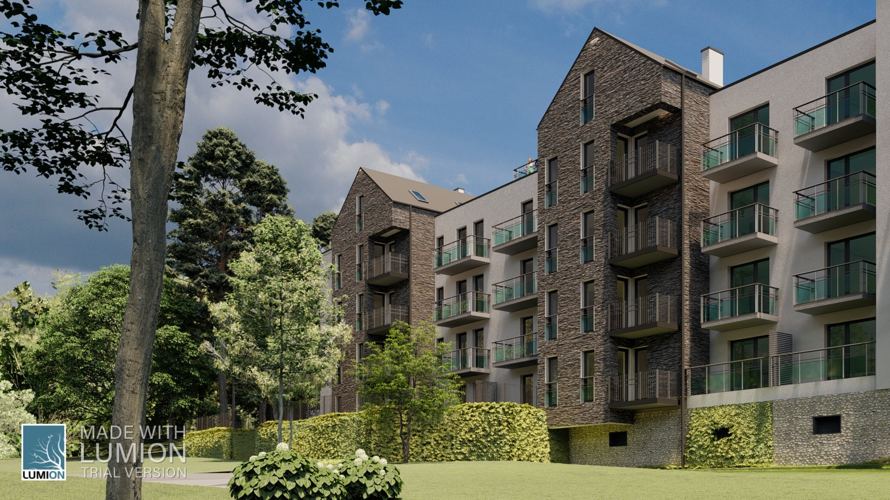
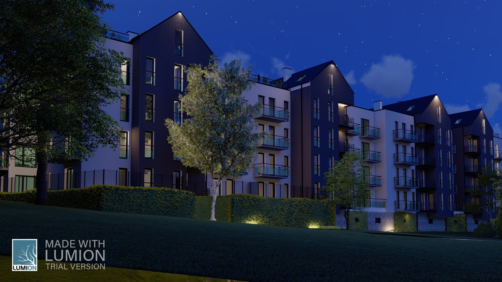

# Slavita Park

  

  

    <strong>Typ</strong>
    Budynek wielorodzinny
  

  

    <strong>Powierzchnia</strong>
    3890m3
  

  

    <strong>Stadium</strong>
    Realizacja
  

  

    <strong>Lokalizacja</strong>
    Kudowa Zdrój
  

  

    <strong>Realizacja</strong>
    2021
  

---

## O projekcie

Wielofunkcyjny budynek usługowy zlokalizowany w centrum Krakowa. Projekt obejmuje przestrzeń gastronomiczną na parterze, biura na wyższych kondygnacjach oraz lokale handlowe. Zastosowano nowoczesne rozwiązania energooszczędne i wysoki standard wykończenia.

## Zakres prac BIM

- Model architektoniczny LOD351

## Galeria

  <figure class="gallery-item">
    <a href="../../img/portfolio/slavitapark1/1.jpg" class="glightbox" data-gallery="portfolio-slavitapark1">
      
      <figcaption>1</figcaption>
    </a>
  </figure>
  <figure class="gallery-item">
    <a href="../../img/portfolio/slavitapark1/2.jpg" class="glightbox" data-gallery="portfolio-slavitapark1">
      
      <figcaption>2</figcaption>
    </a>
  </figure>
  <figure class="gallery-item">
    <a href="../../img/portfolio/slavitapark1/FINALNE_1 - Photo.jpg" class="glightbox" data-gallery="portfolio-slavitapark1">
      
      <figcaption>Finalne 1   Photo</figcaption>
    </a>
  </figure>
  <figure class="gallery-item">
    <a href="../../img/portfolio/slavitapark1/FINALNE_2 - Zdjęcie.jpg" class="glightbox" data-gallery="portfolio-slavitapark1">
      
      <figcaption>Finalne 2   Zdjęcie</figcaption>
    </a>
  </figure>
  <figure class="gallery-item">
    <a href="../../img/portfolio/slavitapark1/FINALNE_3 - Zdjęcie.jpg" class="glightbox" data-gallery="portfolio-slavitapark1">
      
      <figcaption>Finalne 3   Zdjęcie</figcaption>
    </a>
  </figure>
  <figure class="gallery-item">
    <a href="../../img/portfolio/slavitapark1/FINALNE_4 - Zdjęcie.jpg" class="glightbox" data-gallery="portfolio-slavitapark1">
      
      <figcaption>Finalne 4   Zdjęcie</figcaption>
    </a>
  </figure>
  <figure class="gallery-item">
    <a href="../../img/portfolio/slavitapark1/FINALNE_5 - Zdjęcie.jpg" class="glightbox" data-gallery="portfolio-slavitapark1">
      
      <figcaption>Finalne 5   Zdjęcie</figcaption>
    </a>
  </figure>
  <figure class="gallery-item">
    <a href="../../img/portfolio/slavitapark1/FINALNE_6 - Zdjęcie.jpg" class="glightbox" data-gallery="portfolio-slavitapark1">
      
      <figcaption>Finalne 6   Zdjęcie</figcaption>
    </a>
  </figure>

---

  <a href="../" class="btn btn-outline">Powrót do portfolio</a>

