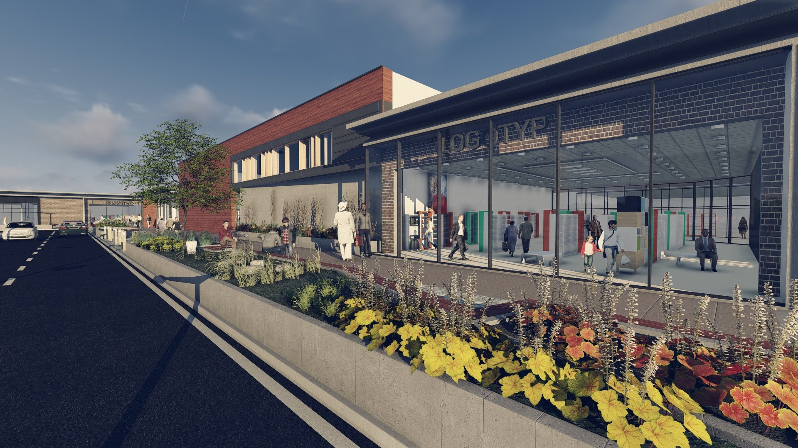
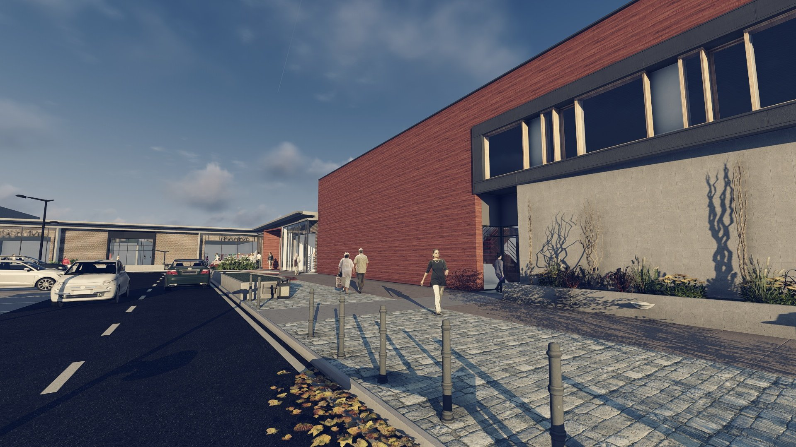
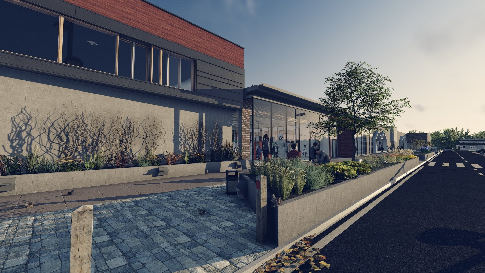
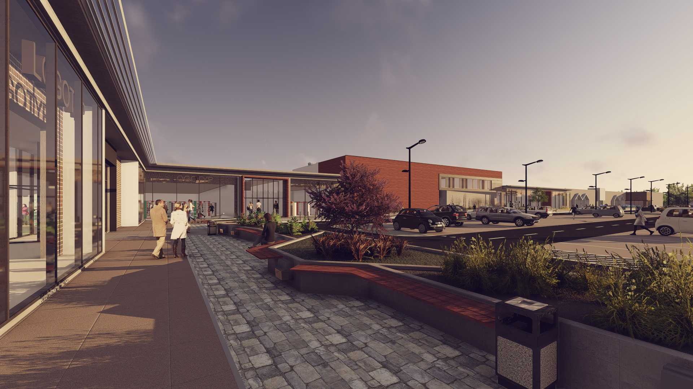
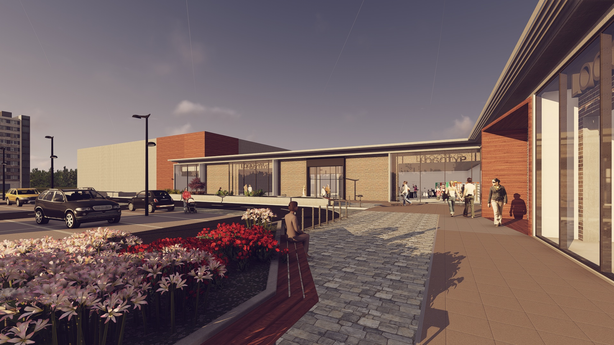
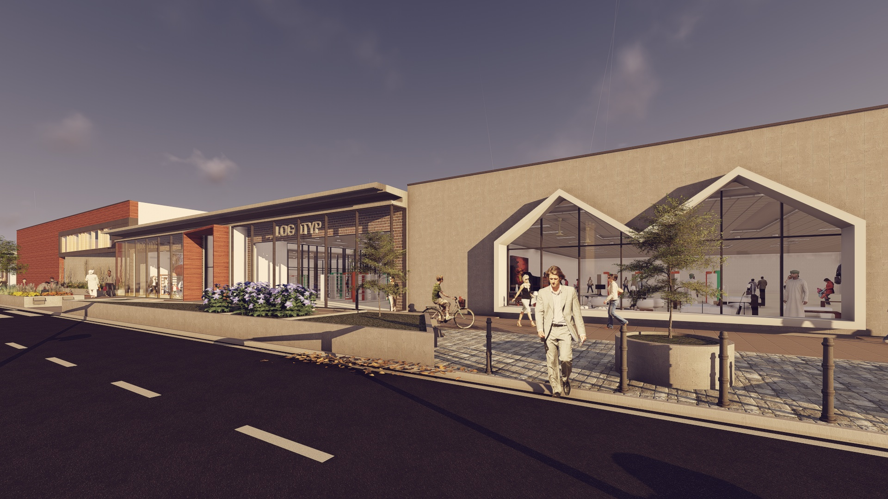
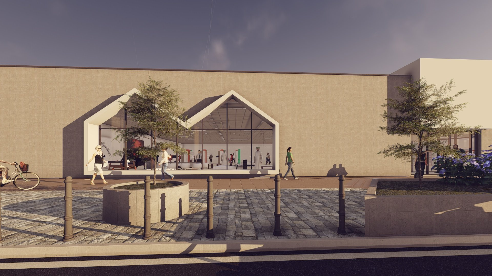
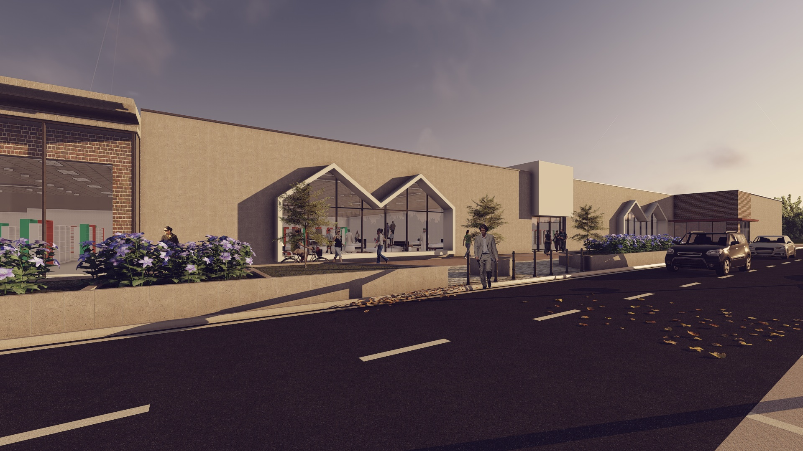

# RetailPark

  

  

    <strong>Typ</strong>
    Budynek handlowy
  

  

    <strong>Powierzchnia</strong>
    23000 m2 
  

  

    <strong>Stadium</strong>
    Koncepcja
  

  

    <strong>Lokalizacja</strong>
    Słubice
  

  

    <strong>Realizacja</strong>
    2018
  

---

## O projekcie

Projekt rewitalizacji historycznego podwórka na krakowskim Kazimierzu. Koncepcja zakłada stworzenie zielonej przestrzeni wspólnej dla mieszkańców z elementami małej architektury i oświetleniem.

## Zakres prac BIM

- Model koncepcyjny
- Wizualizacje
- Inwentaryzacja 3D

## Galeria

  <figure class="gallery-item">
    <a href="../../img/portfolio/slubice/1.jpg" class="glightbox" data-gallery="portfolio-slubice">
      
      <figcaption>1</figcaption>
    </a>
  </figure>
  <figure class="gallery-item">
    <a href="../../img/portfolio/slubice/2.jpg" class="glightbox" data-gallery="portfolio-slubice">
      
      <figcaption>2</figcaption>
    </a>
  </figure>
  <figure class="gallery-item">
    <a href="../../img/portfolio/slubice/3.jpg" class="glightbox" data-gallery="portfolio-slubice">
      
      <figcaption>3</figcaption>
    </a>
  </figure>
  <figure class="gallery-item">
    <a href="../../img/portfolio/slubice/4.jpg" class="glightbox" data-gallery="portfolio-slubice">
      
      <figcaption>4</figcaption>
    </a>
  </figure>
  <figure class="gallery-item">
    <a href="../../img/portfolio/slubice/5.jpg" class="glightbox" data-gallery="portfolio-slubice">
      
      <figcaption>5</figcaption>
    </a>
  </figure>
  <figure class="gallery-item">
    <a href="../../img/portfolio/slubice/6.jpg" class="glightbox" data-gallery="portfolio-slubice">
      
      <figcaption>6</figcaption>
    </a>
  </figure>
  <figure class="gallery-item">
    <a href="../../img/portfolio/slubice/7.jpg" class="glightbox" data-gallery="portfolio-slubice">
      
      <figcaption>7</figcaption>
    </a>
  </figure>
  <figure class="gallery-item">
    <a href="../../img/portfolio/slubice/8.jpg" class="glightbox" data-gallery="portfolio-slubice">
      
      <figcaption>8</figcaption>
    </a>
  </figure>

---

  <a href="../" class="btn btn-outline">Powrót do portfolio</a>

